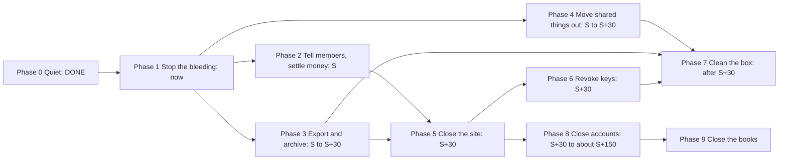

# PLAN: decommission ThriftyCrew, end to end (2026-10-03)

Brad, 2026-10-03: *"We are going to be decommishioning ThrifyCrew slowly. I want you to do two immediate things:
1. Stop the alerts from firing. 2. Create a robust "decom" plan end to end that we can follow. Well start decom at a
future date."*

**Status: PLAN. Phase 0 is DONE. Nothing past Phase 0 has started.** Brad picks the start date, called **S** below.
The Phase 1 items are worth doing before S, because some of the exposure grows every day (section 1). Section 2 lists
every decision only Brad can make, each with a recommendation. A ruling goes into section 2 the turn it is given.

**How to follow it.** Work the phases in order. Each step says who does it, how to check it worked, and how to undo
it. A phase is done when its exit check passes, never when its steps were merely attempted. Steps marked
**Brad** need a login, move money, send a message to members, or change an account setting: those stay with Brad
(Claude can drive a Ghost Admin or dashboard page in the browser with Brad's OK for that step, and can draft every
message). Steps marked **Claude** are repo, box and verification work.

## TLDR

- **Done today:** every scheduled routine is off and alert email is muted. Nothing on the box or in the cloud runs
  on a clock any more.
- **The site is still live and is now going stale.** The deals board shows sale prices that end on Oct 3 and Oct 4
  under the words "checked every morning". A leftover route from the deleted V3 platform still serves August prices.
  Two forms promise replies nobody will send. Phase 1 closes all of that and can start now.
- **Possible money still going out:** a $5/day Google Ads campaign was live in August, and its current state is not
  recorded anywhere on the box. Pausing it is a two-minute job for Brad.
- **One blocker before anything closes:** the Ghost owner login is the old `admin@simplemoneyplaybook.com`, a
  restricted mailbox. Every account's login has to reach a mailbox Brad can read before that account is touched.
- **Members:** 19 in total (5 paying, 7 comped, 7 free). Paying members are on $1 a month or $10 a year through
  Ghost's own Stripe connection. Cancelling Ghost does NOT by itself stop Stripe charging them, so subscriptions end
  first and are checked twice.
- **Other projects lean on ThriftyCrew:** the Gmail sending credentials (also used by flight-watch), FamilyPost's
  narration engine, two `C:\Codex\.claude` links, and the knowledge store's tooling all live in this repo. They move
  out before the repo is archived, and a reversible rehearsal proves it.
- **The box:** 194 worktrees take 308 GB, and 68 of them hold work that exists nowhere else. Everything is swept
  into one verified archive before anything is deleted.
- **Rough timeline:** Phase 1 now (about an hour of Brad's time). At S: announce, settle money, export, migrate. At
  S+30: close the site, revoke keys, clean the box. Stripe stays open about 120 days after the last charge for
  disputes, then the accounts close.

## 0. Done today (2026-10-03)

| What | State | Evidence | Undo |
|---|---|---|---|
| 14 Windows tasks `TC *` | Disabled, not deleted | `Get-ScheduledTask` today: all 14 `Disabled` | `Enable-ScheduledTask -TaskName '<name>'` |
| 26 Claude scheduled tasks | All `enabled:false` | scheduled-tasks list today | re-enable in the app |
| Cloud routines | None exist | RemoteTrigger list today: empty | n/a |
| GitHub workflows `daily`, `gates`, `heartbeat` | Manual-only (`workflow_dispatch`) | `.github/workflows/*.yml` line `on:` | n/a |
| **Alert email** | **Muted, no expiry** | `grocery/alerts-muted.json` `muted: true`, landed on origin/main as `b06660ef2` (run-gates 575 pass, 0 fail, exit 0) | set `muted` to `false` |

**Why the mute covers everything.** Every ThriftyCrew alert, and the knowledge store's own "nightly pass went RED"
mail (`~/.claude/skills/recall-sleep.py` runs this checkout's `grocery/send-alert.ps1`), goes through
`send-alert.ps1`. Its only Gmail call (line 1263) sits after the mute gate (line 1216), and `-Force` cannot punch
through it. Alerts still write `grocery/triage-queue.json`; nothing reads that queue now. Checked by calling the
real `Get-MuteState` on the real file: `muted=True`, "muted since 2026-10-03, no expiry".

**What still sends mail, and why it is not an alert:**
- The Cloudflare Worker's form handlers (`/submit`, `/submit-recipe`, `/alert`, `/notify`): member-facing, closed in
  P1.6.
- Ghost and Stripe system mail (magic links, receipts, staff notifications): account settings, they end with the
  accounts.
- The Worker's off-box "box has gone silent" page was never armed: no `BOX_KV` binding exists, and
  `ops/out/boot-watch-state.json` has `first_configured_utc: null`.
- `~/.claude/flight-watch` sends its own mail with ThriftyCrew's Google credentials. It is not a ThriftyCrew alert,
  so it was left alone (P4.1).

**Expected from now on, never a fault to fix:** a stale board, missing captures, no nightly commits, and any watchdog
or gate saying a TC task is disabled (memory `thriftycrew-wind-down-routines-disabled`).

## 1. What is true right now

Measured 2026-10-03. "Verified" means checked by the planner directly; "reported" means from a read-only helper's
report with its evidence path, not re-checked.

**Members and money**
- 19 members: 7 comped, 7 free, 5 paid (`ops/member-cohorts.json`, generated 2026-10-02 10:30). Verified.
- Tiers: Free, and "All Access" at $1.00/month or $10.00/year; Ghost-native Stripe in live mode. Reported (live
  Content API, memory `ghost-migration`).
- Founders paid once through a Stripe Payment Link and were made lifetime comp members by
  `.claude/skills/lesson/grant-founder.ps1`. How many founders there are is only in Stripe. Reported.
- Refund page: "all payments are final and non-refundable". Privacy page: member data is kept while someone is a
  member "then delete[d]". Reported (`content/ghost-adopted/refunds.html:11`, Ghost export).
- Revenue figure: none recorded anywhere in the repo.

**Reader exposure, getting worse daily**
- Deals board: 193 sale chips read "Sale thru Oct 3" and 80 "Sale thru Oct 4" (`public/board.json`). Verified.
  Nothing on the page hides a sale that has ended. The page says "checked every morning" and "I check these prices
  every morning" (`grocery/build-deals-page.ps1:470,486,488,1989`). Verified.
- Trend pages say "This page updates every week"; start-here says "It updates daily". Reported.
- Recipe cards price from the feed at view time on **everyday** prices (`public/tc-live-price.js:16`), and show no
  date. Verified. Those age out of the 90-day freshness rule cell by cell over the coming months, so they are not
  wrong tomorrow the way the sale chips are.
- A V3 leftover still answers: `https://www.thriftycrew.com/api/v2/recipe-feed/fajita-chicken-rice-bowl` returned
  200, 22,206 bytes of August prices. Verified. Nothing on main and nothing on the live homepage calls `/api/v2`,
  `/v2` or `/member-status`: `member-status` appears only in the deleted V3 code (tag `pre-platform-removal`), and
  the same grep finds `tc-grocery-public` on main, so the empty answer is real; the homepage fetch was 149,429 bytes
  with 0 hits. Verified.
- Forms that promise a reply nobody will send: price-alert signup (`worker/index.js:335-369`, a member who signs up
  never gets an alert now), "Suggest an Item" ("notified when item is added") and "Submit a recipe". Reported.

**Things that may still cost money or post publicly**
- Google Ads account 304-930-1084: a $5/day Search campaign was live on 2026-08-01 (memory `google-ads-campaign`).
  Current status unknown. Verified that the note says so; the account itself needs Brad's login.
- Meta: Facebook reels scheduled in Business Suite up to 29 days ahead keep posting. Reported.
- Ghost(Pro) Publisher plan, Google Workspace seat, Cloudflare (R2 about $0.48/month, plan tier unconfirmed),
  domains renewing July 2027. Reported.

**Account recovery**
- Ghost owner login: `admin@simplemoneyplaybook.com`. That Workspace is "Account Restricted", so a password reset
  goes to a mailbox nobody can read. Verified (memory `mail-auth-thriftycrew`).
- The Cloudflare account that holds the thriftycrew.com **registration** is "Admin@thriftycrew.com's Account".
  Closing the Workspace before moving that login would lock Brad out of his own domain. Reported.
- `simplemoneyplaybook.com` sits in a second Cloudflare account; Brad already chose not to renew it (expires
  2027-07-01). The live Terms and Privacy pages still give `contact@simplemoneyplaybook.com`. Reported.

**The repo and the box**
- GitHub repo `Schweino/ThriftyCrew` is public. Reported.
- Local `main` holds 7 commits from today's triage run (`adaabf835` to `987d83f11`, 10:02 to 10:40) that never
  reached origin: changes to `grocery/apply-coverage-batch.ps1`, `grocery/sync-production-checkout.ps1`,
  `grocery/alert-registry.json`, `grocery/match-verdicts.json` and the triage plan record. Verified. The next push
  from `main` would ship them.
- 194 registered worktrees, 307.9 GB; 64 hold commits no remote has (176 commits), 7 hold uncommitted changes, 68
  in all. 11 more worktree directories are not registered with git and were not checked. 632 local branches, 16
  stashes. The main checkout has 110 modified tracked files and 48 untracked ones. Reported.
- Shared with other projects, so they stay: `C:\Codex\llm` (70 GB, Fantasy uses `.venv-train` and the bf16
  weights), Ollama (13.7 GB, Fantasy), `C:\Codex\tools\node-v22.11.0` (FamilyPost), `C:\Codex\Python312`.
  Reported.

## 2. Decisions for Brad

Each one: what it is, why it matters, the options, and a recommendation. **D1 to D6 are worth ruling now**; D7 to
D11 before S; D12 to D15 before cleanup.

**D1. The live price pages between now and S.** The deals board and trend pages will show ended sales as current
from Oct 4, under "checked every morning". (A) Take the 4 deals-board pages and the 20 trend pages offline now,
pointing their addresses at one short "prices are no longer updated" page. Recipes stay as they are. (B) Turn the
two daily capture tasks back on until S. That costs tokens, runs pushes to main every day, and brings the pages back.
(C) Leave it. **Recommend A**: it is the end state anyway, it is reversible (pages go to draft, not deleted), and it
stops a wrong number reaching a paying reader. Know the cost: the board was about three quarters of all site traffic,
and all-time it had produced 5 free members and 0 paid (memory `board-conversion-surface`, as of 2026-08-04), so A
ends most of the traffic early but no revenue. Ruling: *(none yet)*

**D2. Google Ads.** It may still be spending $5 a day to send people to a site that is closing. **Recommend: Brad
pauses every campaign today** (P1.1). Ruling: *(none yet)*

**D3. New signups.** Every new member from now on is someone who will have to be told, and maybe refunded. (A) Stop
new signups now. (B) Stop them at S. **Recommend A**, using Ghost's "Only people I invite" setting, which keeps sign-in
working for existing members. ("Nobody" would lock existing members out of what they paid for.) Ruling: *(none yet)*

**D4. The scheduled Facebook reels.** They promote the site for up to a month ahead. **Recommend: clear the queue
now** (P1.2). Ruling: *(none yet)*

**D5. The Ghost owner login.** Not a choice, a prerequisite: move it to a mailbox Brad can read before any Ghost
step. **Recommend `admin@thriftycrew.com` now, and then to a personal address before the Workspace closes in Phase
8.** Ruling: *(none yet)*

**D6. The 7 stranded triage commits on local `main`.** (A) Park them on a branch `triage/2026-10-03-unlanded` and
move local `main` back to origin, so nothing ships by accident and the work is kept. (B) Land them through
`ops\push-main.ps1` and let the gates decide. (C) Leave them. **Recommend A**: they fix machinery that is being
switched off, and leaving them on `main` means whoever pushes next ships them unreviewed. Ruling: *(none yet)*

**D7. What happens to the content at close.** (A) Delete everything with Ghost. (B) Keep the 59 lessons, the money
hacks, the glossary and the free calculators readable for free as a static archive served by the existing
`smp-feed` Worker at thriftycrew.com, and take down everything that carries a price (board, trend pages, recipes).
(C) Keep Ghost running free for a while, then (A). **Recommend B**: the lessons are evergreen and are Brad's own
work, the cost is about the domain alone, and nothing frozen can show a wrong price. Recipes stay out because their
costs would freeze and their dishes came from other sites. Ruling: *(none yet)*

**D8. Paying members' money.** (A) Cancel at the end of each paid period; nothing refunded (the refund page says
payments are final). (B) Cancel at S and refund the unused part of each annual plan. (C) Cancel at S and refund each
paying member's latest payment in full. **Recommend C**: with 5 paying members the most it can cost is $50 (if all 5
are annual), it is the simplest to carry out and explain, and it leaves nobody with a reason to dispute a charge.
Ruling: *(none yet)*

**D9. Founders.** They paid once for lifetime access, and lifetime is ending. (A) Refund the founder payment in full.
(B) Refund part. (C) Refund nothing and say thank you. **Recommend A** if the count in Stripe is small; the count
decides the cost. Ruling: *(none yet)*

**D10. Notice period.** **Recommend 30 days** between the farewell email (S) and the close (S+30), with every
lesson and tool free for those 30 days so members can read or save what they paid for. Ruling: *(none yet)*

**D11. The domain thriftycrew.com** (Cloudflare Registrar, renews 2027-07-10). **Recommend: keep it through at least
one renewal** even with no site, so nobody else can buy it and email former members as "Thrifty Crew". Needed anyway
if D7 is B. Ruling: *(none yet)*

**D12. The GitHub repo.** (A) Make it private, then archive it (read-only, reversible). (B) Archive it as public.
(C) Delete it. **Recommend A**: the history carries the whole estate's operating detail, and the local bundle (P3.7)
is the real record either way. Ruling: *(none yet)*

**D13. The knowledge store's tooling** that lives in ThriftyCrew (section 4, Phase 4). (A) Move the few files other
projects read, and retire the rest, including semantic search (the sidecar on port 8077 has been down since about
01:10 today and keyword search keeps working everywhere). (B) Move all of it, sidecar included, and re-register the
nightly tasks. **Recommend A**: it keeps every project working for a fraction of the work. B keeps a model server
alive mainly for a search leg the store's own notes rate as weak (memories `similarity-recall-of-memories-fails`,
`knowledge-store-precision-at-10x`). Ruling: *(none yet)*

**D14. Where the cold archive lives.** It must not be anything that closes with the business (not the
`admin@thriftycrew.com` Google Drive). **Recommend: two copies**, one on an external disk and one in Brad's personal
cloud storage. Ruling: *(none yet)*

**D15. The V3 platform's leftover data** (a 3.27 GB D1 dump already on disk at `C:\Codex\backups\v3-d1\`, and about
42 GB across 4 R2 buckets whose lifecycle rules keep deleting on schedule). **Recommend: delete without exporting
R2, and keep the D1 dump in the cold archive.** It is the abandoned platform's working data; nothing financial lives
there. Ruling: *(none yet)*

## 3. Principles (the order of operations follows from these)

1. **Members and money first, machinery last.** No member is charged for something that is gone: subscriptions end
   before the site does, and are checked again on close day.
2. **Reversible before irreversible.** Phases 1 to 4 can all be undone. Deletions come last and each waits for its
   export to be verified.
3. **An export counts only when it has been opened and counted against the source** (for example, the post count in
   the Ghost JSON equals the count in Ghost Admin). A file that exists is not an export.
4. **Every login reaches a mailbox Brad can read before its account is touched.** The Ghost owner and the Cloudflare
   registrar login are the two that can lock Brad out.
5. **Other projects keep working.** Anything Fantasy, FamilyPost, flight-watch or the knowledge store reads moves out
   first, and a reversible rehearsal (P4.10) proves it before the repo goes.
6. **A key is dead when the service refuses it**, not when its file is deleted. Revoke at the service, then delete
   the file.
7. **Decom work does not restart the machinery.** No pipeline runs. Repo changes are made from a worktree, committed
   with a pathspec and landed with `ops\push-main.ps1`; Ghost changes go through the write journal (`lib/ghost-lib.ps1`)
   or Ghost Admin.

## 4. The phases

### Phase 0. Quiet. DONE 2026-10-03

See section 0. Exit check passed: no TC routine, Claude task or cloud routine is enabled; `Get-MuteState` reads
`muted=True`.

### Phase 1. Stop the bleeding (now, before S; every step reversible)

- [ ] **P1.1 Brad: pause Google Ads** (D2). Account 304-930-1084, and confirm the old 490-914-1235 under manager
  656-183-5141 is still paused. Check: every campaign shows Paused and today's spend is $0. Undo: resume.
- [ ] **P1.2 Brad: clear the scheduled Facebook reels** (D4). Business Suite, Planner. Check: nothing scheduled.
  Undo: none needed; the reels are on disk under `media/`.
- [ ] **P1.3 Brad: make every login recoverable** (D5). Ghost owner to `admin@thriftycrew.com` (Ghost Admin, Settings,
  Staff, your profile). Then confirm each of these logins reaches a mailbox Brad can read, and note which: Ghost,
  Stripe, both Cloudflare accounts, Google Ads, Search Console, Bing Webmaster, Meta, GitHub. Check: a password-reset
  or verification email for Ghost actually arrives. Undo: change it back.
- [ ] **P1.4 Claude, with Brad's OK: take the price pages offline** (D1). Draft the 4 deals-board pages
  (`omaha-grocery-prices`, `-beta`, `shop-smart-at-your-store`, `omaha-price-tracker`) and the 20 public
  `*-price-omaha` trend posts; publish one short page saying the prices are no longer updated; add redirects from the
  drafted addresses to it (the redirect file is `grocery/redirects-base.yaml` plus the trend redirects from
  `grocery/build-trend-redirects.ps1`, uploaded in Ghost Admin, Labs). Record each write in the Ghost write journal.
  Check: each old address returns the notice; the live HTML of the site no longer contains "checked every morning";
  the 375px mobile check on the notice page. Undo: republish the drafts (`ops/revert-ghost-write.ps1` undoes a
  journaled write).
- [ ] **P1.5 Brad, or Claude with his OK: remove the frozen V3 routes.** Delete the `tc-grocery-public` zone routes
  (`www.thriftycrew.com/api/v2/*`, `/v2/*`, `/member-status*`; `ops/cloudflare-estate.json` around line 141). The worker
  itself goes in P5.5. Check: the `recipe-feed` address above returns 404, and a paid recipe still shows its paywall
  correctly. Undo: re-add the routes.
- [ ] **P1.6 Claude, with Brad's OK: close the forms that promise a reply.** Remove the price-alert signup, the
  "Suggest an Item" form and "Submit a recipe" from their pages, and have the Worker's `/alert`, `/submit` and
  `/submit-recipe` answer with a short "closed" message (a `worker/index.js` change, deployed by committing it, since
  Cloudflare builds smp-feed from the repo). Check: each form is gone from its page; a POST to each endpoint gets the
  closed message; nothing emails. Undo: revert the commit.
- [ ] **P1.7 Brad: stop new signups** (D3). Ghost Admin, Settings, Membership, Access: "Only people I invite". Check:
  in a private window, the site offers sign-in but no signup. Undo: set it back to "Anyone can sign up".
- [ ] **P1.8 Claude: the stranded commits** (D6). If A: `git branch triage/2026-10-03-unlanded main`, then move local
  `main` to `origin/main` with `git reset --keep` (it refuses rather than overwrite a dirty file). Check:
  `git log origin/main..main` is empty and the branch holds the 7 commits. Undo: `git reset --keep` back to the
  branch tip.
- [ ] **P1.9 Claude: take a fresh baseline export** with `grocery/ghost-export.ps1` (read-only; the last one is
  `site-backups/ghost-export-2026-10.zip` from 2026-10-01). Check: post count in the export matches Ghost Admin.

**Exit check:** no live page shows a sale price or a "checked this morning" claim; the V3 route is gone; no form
accepts a request; no new member can join; Ads spend is $0; Brad can reset every login.

### Phase 2. Tell members and settle money (day S)

- [ ] **P2.1 Claude drafts, Brad sends: the farewell email** to all 19 members, in Brad's voice (modelled on live
  posts, never the older repo copies). It says what is closing and when (S+30), what happens to their subscription
  and money (D8, D9), that everything is free to read until close (D10), where the lessons will live afterwards (D7),
  how to ask for their data or its deletion, and a contact address that works (`admin@thriftycrew.com`). Check: Ghost
  shows it delivered to all 19; Brad reads the sent copy.
- [ ] **P2.2 Claude, with Brad's OK: fix the policy pages.** Replace `contact@simplemoneyplaybook.com` on Terms,
  Privacy and Refunds with a working address, and add the closing date. Check: the live pages show it.
- [ ] **P2.3 Brad: end every paid subscription** (D8). In Stripe, Billing, Subscriptions, filter Active, cancel each
  (or per member in Ghost Admin). Check: Stripe shows **0 active subscriptions** and Ghost shows 0 paid members.
  Undo: none for a cancelled subscription; a member can re-subscribe until P5.3.
- [ ] **P2.4 Brad: refunds** per D8 and D9, founders found from their Payment Link payments. Check: the list of
  refunds matches the ruling, with the total recorded here.
- [ ] **P2.5 Claude, with Brad's OK: open the paywall for the notice period** (D10). Set paid lessons and tools to
  public (Ghost Admin bulk "Change access", or `lib/ghost-lib.ps1` through the write journal). Recipes stay as they
  are (D7), with one change: `public/tc-live-price.js` labels each price "last checked Oct 2, 2026", which ships by
  committing `public/` (the feed deploy). Check: a logged-out browser reads a paid lesson; a recipe card shows the
  label; the 375px mobile check on one lesson and one recipe.

**Exit check:** every member has been told; Stripe has 0 active subscriptions; refunds match the rulings.

### Phase 3. Export and archive (S to S+30)

- [ ] **P3.1 Claude: Ghost content JSON** (`grocery/ghost-export.ps1`, or Ghost Admin, Settings, Labs, Export). Check:
  posts and pages in the JSON match Ghost Admin's counts (1,569 posts and 19 pages at 2026-10-01).
- [ ] **P3.2 Brad: Ghost members CSV** (Ghost Admin, Members, Export). It holds personal data: keep it only as long as
  the tax records need it (P9.1), and never in the repo.
- [ ] **P3.3 Brad: ask support@ghost.org for the full export (images and themes)**, which the self-serve export does
  not include; also download the theme zip (Settings, Design) and the redirects and routes files (Labs). Ghost(Pro)
  deletes the site at the end of the billing cycle once cancelled, so this lands before P5.3.
- [ ] **P3.4 Brad: Stripe exports** for the year: payments, payouts, customers, tax reports.
- [ ] **P3.5 Claude: sweep every worktree into git, without pushing.** For each of the 68 with unique work: commit any
  uncommitted change to its own branch as `WIP decom sweep`. Check the 11 unregistered worktree directories by hand
  and copy anything unique into a branch. Turn each of the 16 stashes into a branch (`git branch stash-<n> <sha>`),
  since a bundle only carries the top stash. Commit the main checkout's 110 modified and 48 untracked files to a
  branch `decom/final-main-state`, never to `main`. Check: no worktree reports uncommitted tracked changes; the
  stash count equals the new `stash-*` branch count.
- [ ] **P3.6 Claude: bundle the whole repo**: `git bundle create thriftycrew-all-<date>.bundle --all`. Check:
  `git bundle verify` passes, and a clone from the bundle into a temp folder lists as many branches as the repo
  (632 or more after P3.5).
- [ ] **P3.7 Claude: archive the data git never held.** One compressed archive of: `graph/sqlite/graph.db` (432 MB),
  the boards `grocery/out/comparison-*.json` (111 MB), `grocery/out/archive` (507 MB), captures (431 MB plus Fareway
  95 MB), `candidates*` and `records-*` (139 MB), the ledgers, `ops/ghost-journal.jsonl` (206 MB), logs (35 MB),
  `meal-prep/db/built` (44 MB), the `recipes-db.json.bak-*` files, `media/videos` (2.17 GB) and `media/reels/out`,
  `site-backups` (78 MB), `%LOCALAPPDATA%\ThriftyCrew` (0.29 GB) and, per D15, the D1 dump (3.27 GB). Deliberately
  left out: `sidecar/models` and `.venv` (D13), `meal-prep/db/page-cache`, the embed cache, and
  `grocery/out/browser-profiles`, which hold signed-in store sessions and are credentials (deleted in P6, never
  archived). Check: the archive's file list and total bytes match a manifest taken from the source, and one file of
  each kind opens.
- [ ] **P3.8 Brad: store two copies** per D14 and write their locations here. Check: each copy's size matches.

**Exit check:** every export opened and counted; the bundle clones; two copies exist outside anything that closes.

### Phase 4. Move shared things out of ThriftyCrew (S to S+30; must finish before Phase 7)

Found by a read-only survey on 2026-10-03; each line names where it lives now.

- [ ] **P4.1 Gmail sending.** The OAuth client and token sit in `.claude/skills/lesson/` and belong to
  `admin@thriftycrew.com`, which closes in Phase 8. `~/.claude/flight-watch/send_alert.py:15` reads them. Give
  flight-watch its own credential under a personal Google account, and repoint it. Check: flight-watch's own test
  send arrives.
- [ ] **P4.2 FamilyPost's narration** runs ThriftyCrew's `media/reels` (`FamilyPost scripts/walkthrough/narrate.mjs:23`),
  along with the Azure Speech key (`AZURE_SPEECH_KEY`). Move the engine into FamilyPost or `C:\Codex\tools`. Check:
  a FamilyPost narration dry run.
- [ ] **P4.3 Links and agents.** `C:\Codex\.claude\skills` and `C:\Codex\.claude\agents` are links into ThriftyCrew:
  delete them. Remove the 9 ThriftyCrew-only agents from `~/.claude/agents` (recipe-*, triage-*,
  post-publish-reviewer), which load in every project.
- [ ] **P4.4 Guidance other projects load.** `.claude/rules/measurement.md` and `docs/EFFORT-GUIDE.md` are cited by
  the global CLAUDE.md (lines 49 and 88) and by `recall-reflex-hook.py:120`. Move them into `~/.claude/skills`
  (experiment-craft and prompt-craft) and repoint. Copy the push-account guidance that `C:\Codex\CLAUDE.md:59-60`
  points at into that file. Copy the general PowerShell and gate lessons in `.claude/rules/ops-and-gates.md` into a
  skill, since nothing loads them once the repo is gone.
- [ ] **P4.5 The commit-message citation check.** `ops/store_citation.py` and `ops/replay-store-citations.py` are
  used by the `~/.claude` commit-msg hook (`skills/hooks/commit-msg:28`) and the weekly usage report. Move them into
  `~/.claude/skills` and repoint. Fantasy keeps its own copy and only loses the drift check against ours.
- [ ] **P4.6 Hard-coded fallbacks.** About 18 scripts in `~/.claude/skills` fall back to `C:\Codex\ThriftyCrew` when
  `RECALL_ESTATE_ROOT` is unset (`recall_core.py:464`, `knowledge-search/search.py:1602`, `recall-sleep.py:85` and
  others). Change the default to "no estate" rather than to another project. Check: `git grep` in the store finds no
  live `C:\Codex\ThriftyCrew` default, and each script's self-test passes.
- [ ] **P4.7 The knowledge store's nightly tooling** (D13). If A: retire TC Recall Sleep 0435, TC Brain Digest 0645
  and TC Sidecar Watchdog, and the recall hooks' semantic leg (`recall_semantic.py:47`, `recall-embed-memory.py:40`,
  `recall-reindex.py:49`). Memory edits then need a manual commit of the `~/.claude` store, so write that into the
  global CLAUDE.md. If B: move `sidecar/` and its scripts out and re-register the tasks on the new paths.
- [ ] **P4.8 Settings.** Remove the `production_barrier.py` hook (`~/.claude/settings.json:117`, it starts Python on
  every write in every project), the `push-queue` plugin (`settings.json:4`, it only works inside ThriftyCrew), and
  the `TC_WRITE_JOURNAL` user environment variable.
- [ ] **P4.9 Memory stays put.** `~/.claude/projects/C--Codex-ThriftyCrew/memory` lives outside the repo, is backed
  up by the `claude-store` repo, and is searched from every project. **Never delete it as ThriftyCrew cleanup.**
  Optionally move its roughly 100 general lessons into `C--Codex/memory`.
- [ ] **P4.10 Claude: the rehearsal.** Rename `C:\Codex\ThriftyCrew` to `C:\Codex\ThriftyCrew.offline` for one hour
  (nothing runs on a clock, so nothing misses it), then check: a Fantasy session's prompt hook and `knowledge-search`
  run clean; a commit in `~/.claude` and in Fantasy passes its hook; flight-watch and FamilyPost run. Rename it back.
  **Exit check:** every one of those exits 0 with ThriftyCrew absent.

### Phase 5. Close the site (S+30)

- [ ] **P5.1 Brad: re-check money.** Stripe: 0 active subscriptions, no refund pending, no open dispute.
- [ ] **P5.2 Claude: the archive** (D7, if B). Crawl the public lesson, money-hack, glossary and free-tool pages while
  the paywall is open, strip the Ghost member scripts and anything that carries a price, and serve the result from
  the `smp-feed` Worker's assets. Check: every archived page loads, internal links resolve, the 375px mobile check,
  and a search of the archive finds no "$" price figure outside the lessons' own worked examples.
- [ ] **P5.3 Brad: switch Ghost off.** Membership Access to "Nobody", then cancel Ghost(Pro). Only after P3.1 to P3.3
  are verified. Ghost deletes the site at the end of the billing cycle.
- [ ] **P5.4 Brad, or Claude with his OK: DNS.** Point `www` at the archive (D7 B) or remove it (D7 A); remove
  `beta`; remove `feed` when the Worker goes. Keep MX, SPF, DKIM and DMARC while the Workspace exists.
- [ ] **P5.5 Brad, or Claude with his OK: the Cloudflare estate.** Delete `tc-grocery-public`, `tc-grocery-v3` and its
  secrets, the 3 Workflows, the `tc_grocery_funnel` Analytics Engine dataset, the D1 database (per D15) and the 4 R2
  buckets (empty first). Keep or delete `smp-feed` per D7. Revoke the Cloudflare app's access to the GitHub repo.
  Check: the account lists only what D7 and D11 keep, and `beta.thriftycrew.com` and the old routes answer nothing.

**Exit check:** nothing serves a ThriftyCrew price anywhere; Ghost is cancelled; Cloudflare holds only what was ruled
to stay.

### Phase 6. Revoke every key (S+30)

Revoke at the service first, then delete the local file. Check each by using the old key once: it must be refused.

- [ ] Ghost Admin integration key: delete the integration in Ghost Admin before P5.3. It sits as plain text in three
  local files (`meal-prep/.ghostkey`, `meal-prep/archive/orig/.ghostkey`, `.claude/skills/lesson/ghost-config.ps1:7`),
  none tracked, and it was printed once into a helper's private session log on 2026-10-03, so **if Ghost stays up
  for long, rotate it sooner.**
- [ ] GitHub: Actions secrets `GHOST_ADMIN_KEY`, `KROGER_CLIENT_ID`, `KROGER_CLIENT_SECRET`, and the leftovers
  `OPENAI_API_KEY`, `TC_AGENT_APP_ID`, `TC_AGENT_APP_PRIVATE_KEY`, variable `TC_V3_API_ORIGIN`; the TC agent GitHub
  App; any repo webhook to the V3 Worker; any token behind V3's `GITHUB_DISPATCH_TOKEN`.
- [ ] Kroger developer app (`grocery/.krogerkey`); USDA FoodData Central key (`meal-prep/db/fdc-api-key.txt`).
- [ ] Search Console service-account key (`ops/.gsc-key.json`): delete that key only, in Google Cloud project
  `claude-mock-trade`, which may be shared.
- [ ] Google OAuth: revoke ThriftyCrew's client at the Google account's third-party access page, after P4.1.
- [ ] `OPENAI_API_KEY` in the user environment: nothing live in this repo reads it; check other projects, then revoke.
- [ ] Cloudflare: the `CLOUDFLARE_API_TOKEN` user variable and the wrangler login. FamilyPost runs `wrangler dev`, so
  check what it needs before logging out.
- [ ] Store sessions: delete `grocery/out/browser-profiles` (Walmart, Sam's Club with a membership sign-in, Baker's,
  Fareway) and the `%TEMP%\tc-demo-chrome-*` profiles.

### Phase 7. Clean the box (after P3 verified and P4.10 passed)

- [ ] Unregister the 14 `TC *` Windows tasks (`Unregister-ScheduledTask`). Safe once nothing watches them: the only
  watcher, `grocery/health-heartbeat.ps1`, runs from one of those tasks.
- [ ] Delete the ThriftyCrew Claude scheduled tasks (D13 decides `store-usage-weekly` and `recall-cluster-rulings`).
- [ ] Remove the worktrees (`git worktree remove`), the 11 unregistered directories, and the ThriftyCrew `%TEMP%`
  directories (about 2 GB). Frees about 310 GB.
- [ ] Delete `sidecar/models` and `.venv` (11 GB) unless D13 is B; the page and embed caches; `C:\Codex\_quarantine`'s
  ThriftyCrew folder; `C:\Users\Owner\.claude-wt\approvals` (the Approvals Page).
- [ ] Keep: `C:\Codex\llm`, Ollama, `C:\Codex\tools\node-v22.11.0`, `C:\Codex\Python312`.
- [ ] After 30 days with the bundle and archive verified in two places: delete `C:\Codex\ThriftyCrew`. Make the
  GitHub repo private and archive it (D12).
- [ ] Update the project table in `C:\Codex\CLAUDE.md` (ThriftyCrew: archived, where the bundle lives) and the
  wind-down memory.

### Phase 8. Close the accounts (S+30 to about S+150)

Order matters: logins move off `admin@thriftycrew.com` before the Workspace closes.

- [ ] Move to a personal address: the Cloudflare login that holds the domain registration (first), Stripe, Google
  Ads, Search Console, Bing, Meta, GitHub if needed.
- [ ] Google Ads: close 304-930-1084, the dormant 490-914-1235 and the manager 656-183-5141.
- [ ] Meta: unpublish or delete the Facebook Page.
- [ ] Old Workspace `admin@simplemoneyplaybook.com` and the second Cloudflare account: close; the domain is already
  set not to renew.
- [ ] Substack `maptosuccess`: decide, close if unused.
- [ ] Cloudflare: drop to the free plan if on a paid one; keep thriftycrew.com per D11.
- [ ] **Stripe: keep the account open at least 120 days after the last charge or refund**, because card networks let
  a cardholder dispute up to 120 days after a transaction. Then download the year's tax documents and close it.
- [ ] Google Workspace `admin@thriftycrew.com`: last of all, after the items above and P4.1.
- [ ] Check: one full month in which no vendor charges anything (Brad, on the bank statement).

### Phase 9. Close the books

- [ ] Ask an accountant how long to keep the financial records (not something this plan can answer). Keep the
  Stripe exports that long; delete the members CSV and anything else personal that the records do not need, as the
  privacy page promised.
- [ ] Mark this plan DONE with the date and the landed hash of the last change.

## 5. Undo, per phase

| Phase | Can be undone? | How |
|---|---|---|
| 0 | Yes | re-enable tasks; `muted: false` |
| 1 | Yes | republish drafts, re-add routes, revert the Worker commit, reopen signups, resume Ads |
| 2 | Partly | a cancelled subscription and a refund are final; the email is sent |
| 3 | Yes | exports only add files |
| 4 | Yes | every move is a commit in its own repo |
| 5 | **No, once the Ghost billing cycle ends** | before then, Ghost support can stop a cancellation |
| 6 | **No** | a revoked key is re-issued, never restored |
| 7 | Only from the bundle and the archive | which is why P3 is verified first |
| 8 | **No** | |

## 6. Risks and their guards

| Risk | Guard |
|---|---|
| Members charged after the site is gone (Stripe outlives Ghost) | P2.3 and P5.1 both check Stripe for 0 active subscriptions |
| Locked out of the domain when the Workspace closes | Phase 8 moves the Cloudflare login first |
| Ghost recovery goes to a dead mailbox | P1.3 before any Ghost step |
| Another project breaks | Phase 4, proved by the P4.10 rehearsal |
| Losing work held only in worktrees, stashes or the main checkout | P3.5 sweep, P3.6 bundle clone check, before Phase 7 |
| A wrong price on a live or archived page | P1.4 now; P5.2 archives nothing that carries a price |
| R2 lifecycle rules delete data on schedule | D15 decides whether anything is wanted; if so, export early |
| A gate or watchdog complaining that a TC task is off | expected, never repaired (section 0) |
| A decom commit sweeping in another session's files | pathspec commits from a worktree, `git show --stat HEAD` after each |

## Knowledge consulted

Searched 2026-10-03 with `knowledge-search/search.py` for "decommission shut down wind down project", "mute email
alerts send-alert" (`--estate`), "Ghost members paid tier Stripe paywall", "Cloudflare estate R2 D1 Ghost admin key",
"sidecar llama-server worktrees disk scheduled tasks" and "shared knowledge store Fantasy depends recall hook". Used:

- memory `thriftycrew-wind-down-routines-disabled`: the 14 tasks and 26 Claude tasks were disabled, not deleted, and
  a complaint about them is expected. Section 0 and Phase 7.
- memory `force-bypasses-the-daily-gate-not-the-mute`: `-Force` beats the once-a-day gate, not the mute. Section 0.
- `reliability-craft/applies-here.md`, "What the estate has under other names": the queue write comes before the mute
  gate, and should stay that way. Section 0.
- `growth-craft/applies-here.md` section 1: every Ghost member call is transactional, and no member export exists.
  P3.2.
- `software-craft/applies-here.md` section 42: where the Ghost Admin key is read from. Phase 6.
- memory `cloudflare-r2-buckets-outside-git`: the 4 buckets, about 42 GB, about $0.48/month, `tc-grocery-v3` still
  serving. P5.5, D15.
- memories `mail-auth-thriftycrew`, `google-ads-campaign` and `item-request-form` (store `C--Codex`): the Ghost owner
  login, the Ads campaign, the form's mail path. Section 1, P1.1, P1.3, P1.6.
- memories `similarity-recall-of-memories-fails` and `knowledge-store-precision-at-10x`: the case for D13 A.
- Estate search from this worktree (`--estate --estate-root`, "decommission plan shut down site members export
  archive", 5 legs, 21 hits, blind 0): `growth-craft/applies-here.md` section 4 (no member data is exported, stored
  or committed anywhere, so P3.2 is a new export, done in Ghost Admin) and memory `board-conversion-surface` (the
  board's share of traffic and its signups, used in D1). The other hits did not apply.
- `experiment-craft/analysis-preflight.md`: items 8 (a delegated finding is an input, hence "reported" against
  "verified" in section 1) and 10 (an empty search must prove itself, hence the positive controls on the
  `/member-status` check).
- Outside facts, checked on the web 2026-10-03: Ghost's Access setting has "Only people I invite" and "Nobody", and
  "Nobody" turns off sign-in as well (ghost.org/help/can-i-disable-memberships); the self-serve export holds posts,
  pages, tags, settings and staff, and images and themes come from Ghost support (ghost.org/help/exports,
  ghost.org/help/manage-your-subscription); a cancelled Ghost(Pro) site is deleted at the end of its billing cycle
  (same page); cardholders can dispute up to 120 days after a transaction (stripe.com/docs/disputes/how-disputes-work).
- Four read-only helper surveys on 2026-10-03 (members, money and content; cloud and accounts; the local box;
  dependencies of other projects). Their findings are inputs, cited as "reported" in section 1. The ones that drive a
  decision were re-checked directly and are marked "verified".
